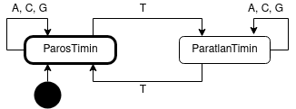

# Egy kis genetika
**Szorgalmi feladat Karsa Zoltántól**. (extra pont: 3)

Genetikai kódunkat a következő 4 bázis alkotja: 

 * Adenin (A)
 * Citozin (C)
 * Guanin (G)
 * Timin (T)

A genetikai vizsgálatunkhoz egy olyan programot kell írni, ami egy előre meghatározott leírásból (továbbiakban konfiguráció) képes létrehozni egy állapotgépet és egy DNS lánc elemzését el tudja végezni a konfiguráció alapján. 

## Emlékeztető
Emlékezz vissza a Programozás alapjai 1 illetve a Digitális technikák tárgyon használt állapotgépekre (véges automaták), mire voltak elegendőek? Hogyan működtek? 

A korábbi tantárgyakkal ellentétben itt az egyes állapotátmeneteknél nem lesz elvégzendő tevékenység (pl.: ly számláló esetén a számláló növelése, ha ly-t találtunk), hanem lesznek érvényes, "elfogadó" állapotok, azaz miután a bemenet elfogyott, és ilyen állapotban van az automata, elfogadunk, a bemenet jó volt, különben nem. Ezzel gyakorlatilag a véges automaták matematikai modelljéhez jutunk (Bővebben majd algoritmuselmélet tárgyon). Emiatt a korábban megismert ly számláló mását (pl. AC számláló) nem lehet megvalósítani, csak azt tudjuk eldönteni hogy van-e benne AC szakasz, vagy van-e benne 3db AC szakasz, számlálni nem lehet.

## Konfiguráció
Konfigurációs fájl első sora az állapotok számát kódolja (N), a következő N sorban, soronként az állapotok típusa (elfogadó - I, nem elfogadó - H) és az állapotok nevei (max 20 karakter) találhatóak, szóközzel elválasztva. Az első megadott állapot a felsorolásban a kezdőállapot. Ezután az állapotátmeneteket tartalmazó NxN-es mátrix következik a következő formában:

```
A/1->A/1   A/1->A/2  ...  A/1->A/N 
A/2->A/1   A/2->A/2  ...  A/2->A/N 
  ...        ...     ...    ...    
A/N->A/1   A/N->A/2  ...  A/N->A/N 
```

Az első sor a mátrixban az első állapotból (A/1, kezdőállapot) induló átmeneteket mutatja az előző felsorolás sorrendjében, mely bemeneti bázis esetén mely állapotba kerül onnan az automata. A mátrix 2. sorában és 3. oszlopában (A/2->A/3) találhatóak azon bázisok, melyek hatására a 2. állapotból a 3.-ba kell kerüljön az automata... A celábban a bázisok a rövidítésekkel vannak feltüntetve elválasztó jelek nélkül (pl. `CAT`), a mátrix soraiban több és eltérő db szóköz gondoskodik a szeparálásról. Ha valahol nincs átmenet, ott nulla (`'0'`) szerepel.

Beolvasáshoz ajánlott a `std::ifstream` használata, hasonlóan használható, mint az `std::cin`, azaz `>>`-val történő beolvasáskor eldobja a felesleges whitespace-eket.

Minden egyes sorban pontosan egyszer fordulhatnak elő valahol az ACGT betűk, így nem lehet olyan, hogy egy állapotból több állapotba is tudnánk menni egy bázis hatására vagy nem tudnánk eldönteni hova kellene lépni (= az automata determinisztikus és teljes).

## Skeleton program
A beadáshoz készetettem egy tesztprogramot (*genetika_teszt.cpp*) és az `allapotgep.h` fájlban megadtam, hogy az **Allapotgep** osztály miyen publikus interfésszel rendelkezik:
```c++
// A bázisokhoz tartozó felsorolás típus.
enum Bazis {
    Adenin, Citozin, Guanin, Timin
};
// Állapotgép publikis interfésze
class Allapotgep {
public:
    // Konfig fájl beolvasása. Ha a fájl nem létezik/nem lehet megnyitni eldobja a NEPTUN-kódot.
    // Újra felépíti az állapotgépet, a korábbit törli ha volt. Kezdő állapotba áll.
    void konfigural(const char* fajlnev);
    // Visszaadja melyik állapot aktív. 
    const char* aktualisallapot();
    // Elfogadó állapotban van-e az állapotgép.
    bool elfogad();
    // Az aktuális állapotnak és inputnak megfelelő következő állapotba léptet.
    void atmenet(Bazis b);
    // Feldolgozza a paraméterként kapott bázissorozatot.
    // Visszaadja, hogy elfogadó állapotba került-e. (Nem áll vissza kezdő állapotba.)
    bool feldolgoz(const Bazis *b, int n);
    // Kezdő állapotba visz
    void alaphelyzet();
};
```
Két globális függvényt is készítettem az enum kezeléséhez, ami a `char -> Bazis` és `Bazis -> char` konverziót segíti elő. 

A megoldáshoz az **Allapotgep** belső logikája, mezői szabadon megváltoztathatóak, a publikus interfész azonban nem, és nem is bővíthető. Szükség esetén új osztályok szabadon felvehetők az `allapotgep.h` fájlba. (Tipikusan legalább még 1-2 osztály felvétele szükséges a szép megoldáshoz.) Az osztályok tagfüggvényeit az `allapotgep.cpp` fájlban kell megvalósítani.


A `konfigural(const char* fajlnev)` függvény kivételt dob, ha a fájlt nem lehet megnyitni, a kivétel során a **neptun** kódodat kell eldobni. Ha már van egy aktív, beolvasott konfiguráció, akkor a függvény újboli meghívásakor, ammenyiben a fájl létezik, a korábbi konfigurációt törli és alaphelyzetbe áll.  A konfiguráció minden esetben a fenti leírásnak megfelelő, más hibakezelést nem kell megvalósítani.

## Példa
A konfigurációs fájl:
```
2
I ParosTimin
H ParatlanTimin
ACG     T
T       ACG
```
Ezen fájlhoz tartozó állapotgép diagramja:

 

Példa bemenet: `{Adenin, Guanin, Timin, Citozin, Citozin, Timin}`, ekkor elfogadunk (`elfogad()` függvény igaz logikai értékkel térne vissza). Ezen bemenet végeztével az `aktualisallapot()` függvény `"ParosTimin"` karakterláncot adja vissza.

Vizsgáld meg az `implikacio.txt` fájlt is! Rajzold fel a hozzá tartozó diagramot, ha szükséges.

## Megoldás
A Git tárolóból letölthető [https://git.ik.bme.hu/Prog2/szorgalmi_feladatok/genetika](https://git.ik.bme.hu/Prog2/szorgalmi_feladatok/genetika)
fájlok felhasználásával hozz létre a lokális fejlesztőkörnyezetedben egy C++ projektet! Ehhez felhasználható a *Makefile*, amiben megtalálhatók a fordítási opciók. Tervezz, fejlessz, tesztelj, majd töltsd fel a megoldását a Jporta rendszerbe! 

A megoldás során STL tárolók használata tiltott!! A feladat lényege a dinamikus memóriakezelés gyakorlása C++ alatt és az OO fejlesztéssel való ismerkedés. Figyelj az egységbezárásra és arra, hogy a feladatokat egyenletesen oszd el az osztályok között, a szép megoldához, még 1-2 osztály felvétele kell.

## Beadás
Beadandó az `allapotgep.cpp` és `allapotgep.h` fajl. A `genetika_teszt.cpp`-t nem kell beadni, az a teszteléshez van. A Jporta nagyon hasonló programal fog tesztelni.
